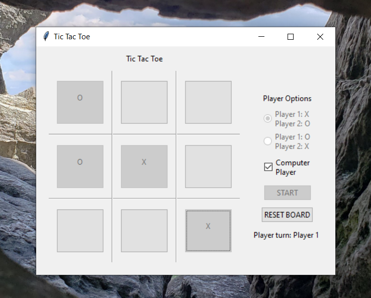

# TicTacToe

TicTacToe game for practice with classes and tkinter gui app construction in python.

I built this fun program using some class definitions (some of which appear in tic_tac_toe_classes.py) and integrated those classes into a tkinter framework in tic_tac_toe_game.py. All the utitlized modules are included in the standard python libary (python version 3.9.12).

Check out a screenshot of the game below!

